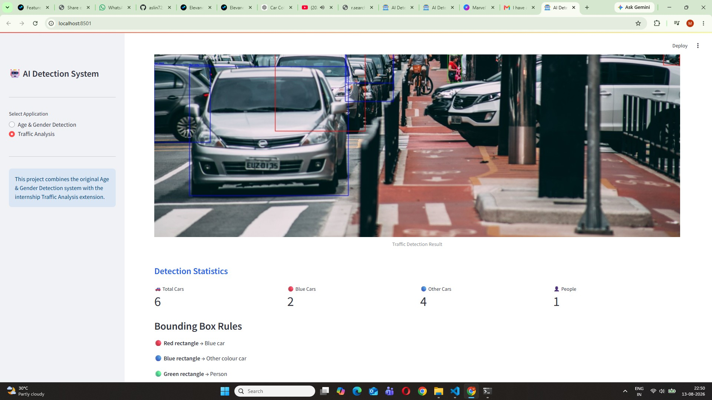

# Task 1 - Car Colour Detection & Traffic Analysis

## Overview

This task extends the original Age & Gender Detection training project by adding a computer vision-based traffic analysis module.

The system analyzes traffic images and detects:

- Cars
- Blue cars
- Other-colour cars
- People

It also counts the detected objects and displays the results through the existing Streamlit GUI.

## Features

- Traffic image upload
- Car detection using YOLO
- Person detection
- Total car counting
- Blue car counting
- Other-colour car counting
- Person counting
- Car colour detection using OpenCV
- Colour-coded bounding boxes
- Streamlit GUI integration

## Bounding Box Rules

| Object | Bounding Box |
|---|---|
| Blue car | Red |
| Other-colour car | Blue |
| Person | Green |

## Example Result

For the provided sample traffic image:

- Total Cars: 6
- Blue Cars: 2
- Other Cars: 4
- People: 1

## Technologies

- Python
- YOLO / Ultralytics
- OpenCV
- NumPy
- Streamlit
- Pillow

## Project Structure

```text
Task-1-Car-Colour-Detection/
│
├── modules/
│   ├── __init__.py
│   ├── colour_detection.py
│   └── traffic_detection.py
│
├── sample_images/
│   └── traffic.jpg
│
├── test_traffic.py
├── yolo11n.pt
└── README.md
## Result Screenshot

