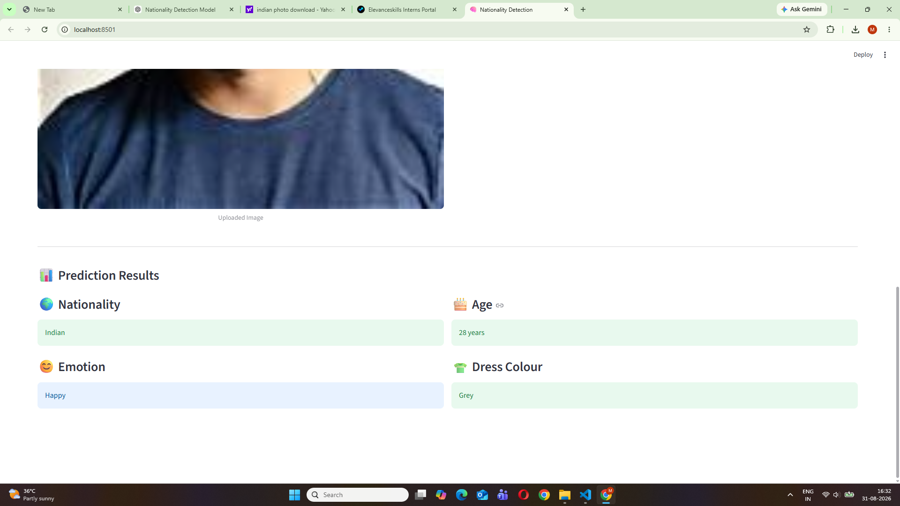

# 🌍 Task 3 - Nationality Detection & Attribute Analysis

## 📌 Project Description

This project implements a machine learning-based image analysis application using **Streamlit**.

The application allows the user to upload an image, preview the image, select the verified nationality, and obtain relevant attributes such as:

- 🌍 Nationality
- 😊 Emotion
- 🎂 Age
- 👕 Dress Colour

The attributes displayed depend on the selected nationality.

---

## 🎯 Task Requirements

The application follows the required conditional logic:

| Nationality | Emotion | Age | Dress Colour |
|-------------|---------|-----|--------------|
| 🇮🇳 Indian | ✅ | ✅ | ✅ |
| 🇺🇸 United States | ✅ | ✅ | ❌ |
| 🌍 African | ✅ | ❌ | ✅ |
| 🌎 Other | ✅ | ❌ | ❌ |

> **Note:** Nationality is provided as a verified input and is not inferred from facial appearance.

---

## 🧠 Models & Technologies

### 🔹 InsightFace

InsightFace is used for:

- Face detection
- Age estimation

The application uses the pretrained `buffalo_l` model.

### 🔹 DeepFace

DeepFace is used for facial emotion recognition.

The application can detect emotions including:

- Angry
- Disgust
- Fear
- Happy
- Sad
- Surprise
- Neutral

### 🔹 OpenCV

OpenCV is used for:

- Image processing
- Dress colour estimation

### 🔹 Streamlit

Streamlit is used to create the graphical user interface for:

- Image upload
- Image preview
- Nationality selection
- Prediction results

---

## 📁 Project Structure

```text
Task-3-Nationality-Detection/
│
├── app.py
├── README.md
├── requirements.txt
├── .gitignore
│
├── models/
│   └── Age_Sex_Detection.h5
│
├── sample_images/
│   ├── test.jpeg
│   ├── test2.jpeg
│   ├── test3.jpeg
│   └── test4.jpeg
│
├── screenshots/
│   └── task3_indian_result.png
│
└── dataset/
```

---

## ⚙️ Installation

### 1. Clone the repository

```bash
git clone https://github.com/mittulsharma2006-sys/AGE_GENDER_DETECTION.git
```

### 2. Navigate to Task 3

```bash
cd AGE_GENDER_DETECTION/Task-3-Nationality-Detection
```

### 3. Create a virtual environment

```bash
python -m venv venv
```

### 4. Activate the virtual environment

For Windows PowerShell:

```powershell
.\venv\Scripts\Activate.ps1
```

If PowerShell prevents script execution, the application can also be run using the Python executable inside the virtual environment.

### 5. Install dependencies

```bash
pip install -r requirements.txt
```

---

## ▶️ Running the Application

Start the Streamlit application with:

```bash
streamlit run app.py
```

The application will open in your web browser.

---

## 🖥️ Application Workflow

### Step 1 - Upload Image

Upload a `.jpg`, `.jpeg`, or `.png` image.

The uploaded image is displayed in the application for preview.

### Step 2 - Select Nationality

Select the verified nationality from:

- Indian
- United States
- African
- Other

### Step 3 - Predict Attributes

Click:

```text
🔍 Predict Attributes
```

The application analyzes the image and displays the attributes required for the selected nationality.

---

## 📊 Example Results

### 🇮🇳 Indian

```text
Nationality: Indian
Emotion: Neutral
Age: 28 years
Dress Colour: Green
```

### 🇺🇸 United States

```text
Nationality: United States
Emotion: Happy
Age: 37 years
```

### 🌍 African

```text
Nationality: African
Emotion: Sad
Dress Colour: Green
```

### 🌎 Other

```text
Nationality: Other
Emotion: Neutral
```

---

## 🖼️ Screenshot

### 🇮🇳 Indian Nationality Prediction

The application successfully predicts the relevant attributes for an Indian subject.



---

## ⚠️ Notes

- Age estimation is an approximate prediction and may differ from a person's actual age.
- Emotion recognition is based on visible facial expressions.
- Dress colour is estimated using image-processing techniques and can be affected by lighting, background, and clothing patterns.
- Nationality is provided as a verified input and is not inferred from facial appearance.

---

## 🛠️ Technologies Used

- Python
- TensorFlow
- Keras
- InsightFace
- DeepFace
- OpenCV
- NumPy
- Pillow
- Streamlit

---

## 👨‍💻 Author

**Mittul Sharma**

GitHub:  
https://github.com/mittulsharma2006-sys